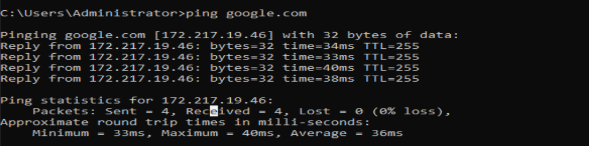

# Day 01 – Windows Server 2019 Installation & Static IP Configuration

## 🎯 Objective
Prepare the base server that will later function as a Domain Controller
by installing Windows Server 2019 and configuring a static IP address.

---

## 🖥️ Environment
- Hypervisor: VirtualBox
- Operating System: Windows Server 2019
- Network Mode: NAT

---

## 🛠️ Steps Performed

### 1️⃣ Windows Server Installation
- Created a new virtual machine in VirtualBox
- Installed Windows Server 2019
- Completed initial system setup and administrator configuration

### 2️⃣ Static IP Configuration
- Configured a static IPv4 address manually
- Set subnet mask and default gateway
- Configured preferred DNS server (temporary setting)

  

---

## 🌐 Network Configuration (Example)
| Setting       | Value              |
|---------------|--------------------|
| IP Address    | 192.168.0.10       |
| Subnet Mask   | 255.255.255.0      |
| Default GW    | 192.168.0.1        |
| DNS Server    | Local              |

---

## 🔐 Why Static IP Is Important
- Servers must have a fixed IP to remain reachable
- Required for:
  - Active Directory
  - DNS
  - Domain services
- Prevents network issues caused by IP changes

---

## 📸 Screenshots
- Windows Server desktop after installation
- Network adapter IPv4 static configuration
- `ipconfig` output in Command Prompt

---

## ✅ What I Learned
- Installing Windows Server in a virtualized environment
- Importance of static IPs for servers
- Basic server network configuration best practices
