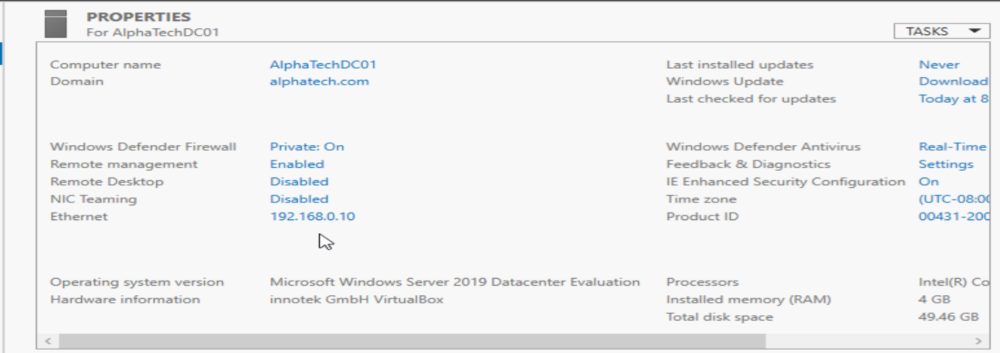
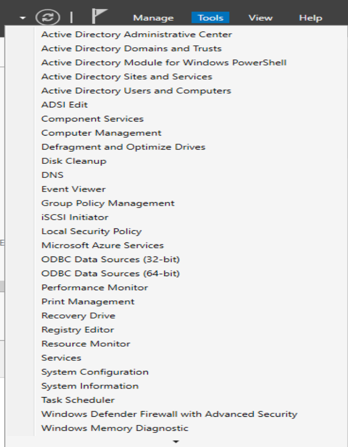
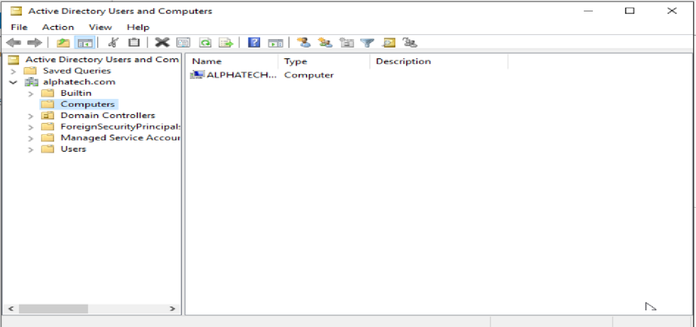

# Day 02 – Domain Controller Setup (AD DS)

## 🎯 Objective
Prepare the core identity infrastructure by renaming the server,
installing Active Directory Domain Services, and promoting the server
to a Domain Controller for the AlphaTech enterprise environment.

---

## 🖥️ Environment
- OS: Windows Server 2019
- Server Name: AlphaTechDC01
- Role Installed: Active Directory Domain Services (AD DS)

---

## 1️⃣ Server Renaming

The server was renamed to follow enterprise naming conventions
and clearly identify its role as a Domain Controller.

- Old name: Default system name
- New name: **AlphaTechDC01**
- Server rebooted to apply changes

---

## 2️⃣ Active Directory Domain Services Installation

Installed the **Active Directory Domain Services** role using Server Manager.

- Selected AD DS role
- Installed required features
- Prepared server for promotion

---

## 3️⃣ Domain Controller Promotion

The server was promoted to a Domain Controller with a new forest.

- Created a new forest
- Domain name: **alphatech.com**
- DNS Server installed automatically
- Global Catalog enabled

---

## 🌐 Domain Configuration Summary

| Setting | Value |
|-------|------|
| Domain Name | alphatech.com |
| Forest Mode | Windows Server 2016+ |
| DNS | Installed on DC |
| Global Catalog | Enabled |

---

## 🔐 Why This Is Important
- Active Directory centralizes authentication and authorization
- Domain Controllers manage:
  - Users
  - Computers
  - Group Policies
- DNS integration is critical for domain functionality

---

## 📸 Verification

After promotion:
- Server rebooted automatically
- Logged in using domain credentials
- Verified AD tools were available

---

## ✅ What I Learned
- Importance of server naming conventions
- How to install and promote a Domain Controller
- Relationship between AD DS and DNS
- Creating a new forest and domain
