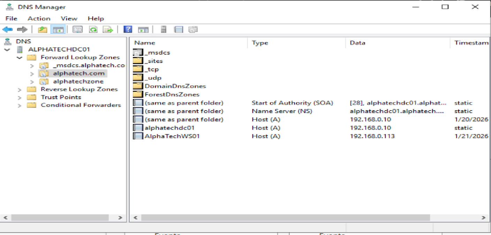
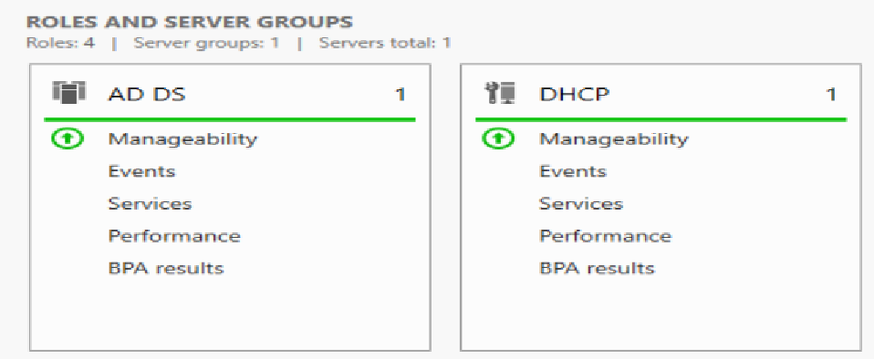
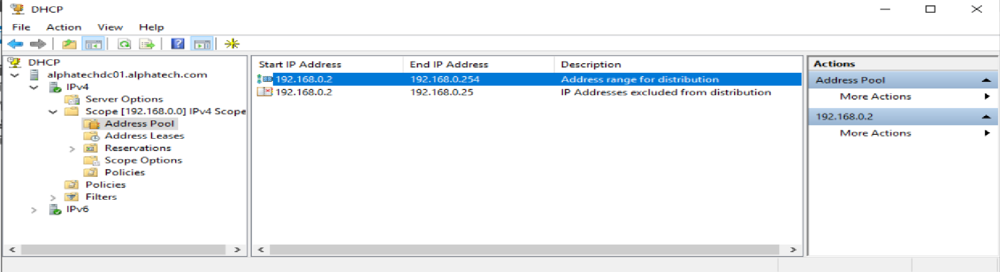
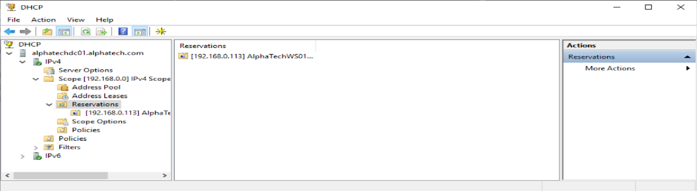
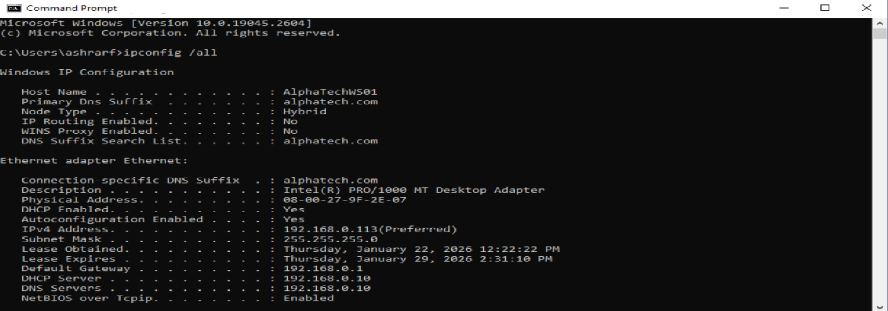

# Day 03 – DNS & DHCP Configuration with Reservation

## 🎯 Objective
Configure core network services by validating DNS functionality,
deploying a DHCP server, and assigning a reserved IP address
to a domain-joined client.

---

## 🖥️ Environment
- Domain Controller: AlphaTechDC01
- OS: Windows Server 2019
- Domain: alphatech.com
- Client OS: Windows 10
- Services: DNS, DHCP

---

## 1️⃣ DNS Validation (Active Directory Integrated)

DNS was automatically installed during Domain Controller promotion.
Its functionality was verified to ensure proper name resolution
for domain services and clients.

- Forward lookup zone: **alphatech.com**
- AD-integrated DNS
- Required SRV records present

---

## 2️⃣ DHCP Server Role Installation

The DHCP Server role was installed on the Domain Controller
to provide automatic IP address assignment to clients.

Steps:
- Installed DHCP Server role via Server Manager
- Authorized DHCP server in Active Directory
- Verified DHCP service status

---

## 3️⃣ DHCP Scope Configuration

A DHCP scope was created to define the IP address range
for client machines.

- IP range configured
- Subnet mask defined
- Default gateway assigned
- DNS server set to Domain Controller

---

## 4️⃣ DHCP Reservation for Client Computer

A DHCP reservation was created to ensure a specific client
always receives the same IP address.

- Reservation based on MAC address
- Reserved IP assigned to domain-joined Windows 10 client
- Client successfully received reserved IP

---

## 🔍 Verification

- Client obtained IP address automatically via DHCP
- Reserved IP matched configuration
- Client visible in Active Directory

---

## 🔐 Why This Is Important
- DNS is critical for Active Directory functionality
- DHCP centralizes network configuration
- DHCP reservations combine flexibility with predictability
- Common practice for servers and critical workstations

---

## ✅ What I Learned
- How DNS integrates with Active Directory
- Installing and authorizing a DHCP server
- Creating DHCP scopes and reservations
- Verifying dynamic IP assignment
