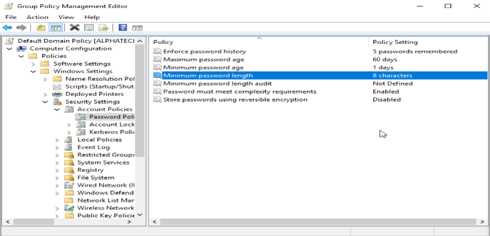
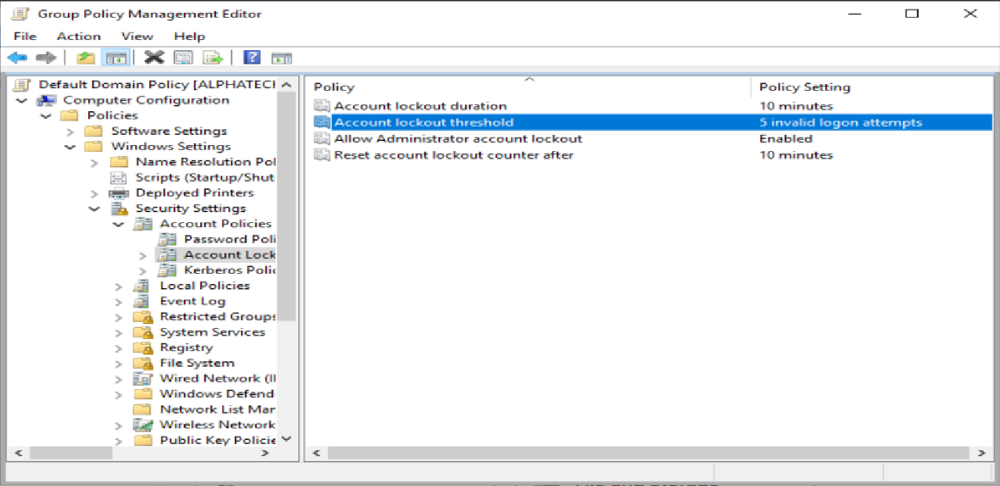
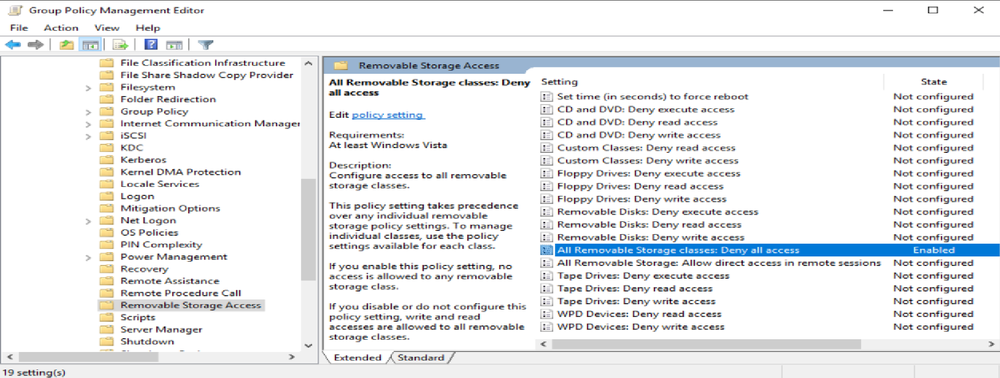

# Day 05 – Group Policies (GPO)

## 🎯 Objective
Apply enterprise-level policies to enforce security and management standards
across Active Directory users and computers.

---

## 🖥️ Environment
- Domain Controller: AlphaTechDC01
- OS: Windows Server 2019
- Domain: alphatech.com
- AD Tool: Group Policy Management Console (GPMC)

---

## 1️⃣ Password Policy

Configured domain-wide password policy:

- Minimum length: 8 characters
- Complexity: Enabled (uppercase, lowercase, number, symbol)
- Maximum password age: 60 days
- History: Remember last 5 passwords

---

## 2️⃣ Account Lockout Policy

Configured account lockout to prevent brute-force attacks:

- Lockout threshold: 5 failed login attempts
- Lockout duration: 10 minutes
- Reset counter: 10 minutes

---

## 3️⃣ USB Storage Restriction

Applied a GPO to **Finance OU** to disable USB storage devices:

- Policy linked to Finance OU only
- Tested on a client computer under Finance user

---

## 🔐 Why This Is Important
- Enforces security standards across the domain
- Reduces risk of data breaches
- Demonstrates enterprise-level user management

---

## ✅ What I Learned
- How to create and link GPOs to OUs
- Implementing password and lockout policies
- Applying device restrictions via GPO
- Testing policies on domain-joined clients
