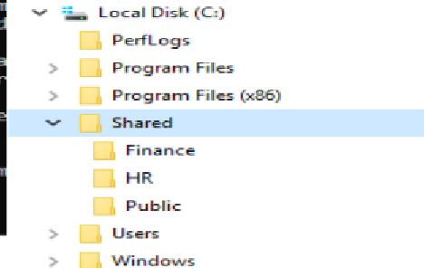
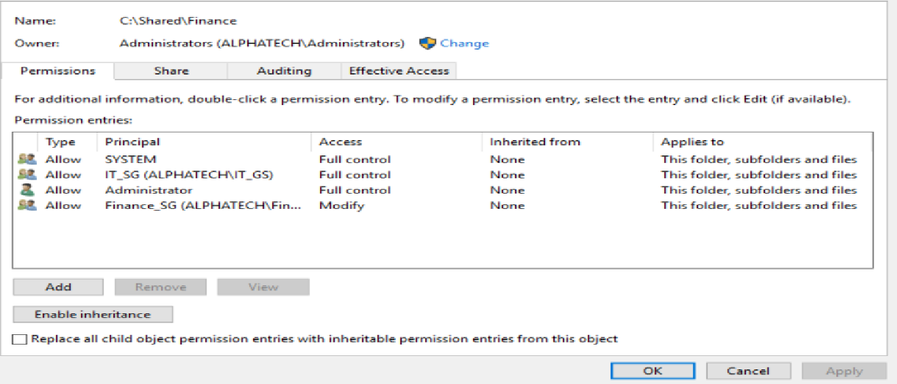
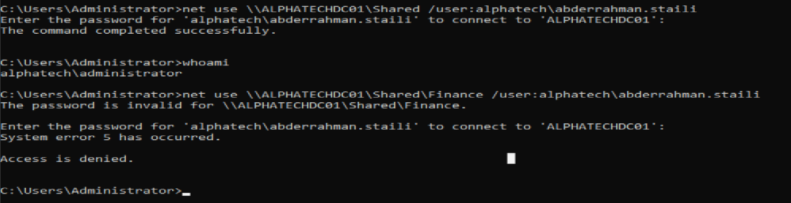

# Day 06 – File Server: Shared Folders & NTFS Permissions

## 🎯 Objective
Set up shared folders for departments and apply correct NTFS permissions
to control access for domain users.

---

## 🖥️ Environment
- Server: AlphaTechDC01 (Domain Controller + File Server role)
- Client OS: Windows 10 (domain-joined)
- Domain: alphatech.com

---

## 1️⃣ Shared Folders Creation

Created the following folders on the file server:

- `D:\Shared\HR`
- `D:\Shared\Finance`
- `D:\Shared\Public`

Shared the root folder `D:\Shared` with **Authenticated Users → Read**.
Controlled access using **NTFS permissions** on subfolders.

---

## 2️⃣ NTFS Permissions Configuration

Applied security best practices:

| Folder  | Allowed Users / Groups   | Permissions        |
|---------|------------------------|-----------------|
| HR      | HR_SG                  | Full Control      |
| Finance | Finance_SG             | Full Control      |
| Public  | Authenticated Users    | Read             |

> ⚠ Golden Rule: Never assign NTFS permissions directly to users; always use **security groups**.

---

## 3️⃣ Testing Access

Verified access from client computers for different users:

- HR user → access HR + Public ✅, Finance ❌
- Finance user → access Finance + Public ✅, HR ❌
- IT user → access Public only ✅

---

## 🔐 Why This Is Important
- Ensures **departmental security** and **data privacy**
- Demonstrates **enterprise-level permission management**
- Reinforces understanding of **security groups + NTFS + GPO principles**

---

## ✅ What I Learned
- How to create shared folders on a server
- Proper NTFS permissions assignment using security groups
- How to test user access and validate permissions
- Best practices for enterprise file server management
